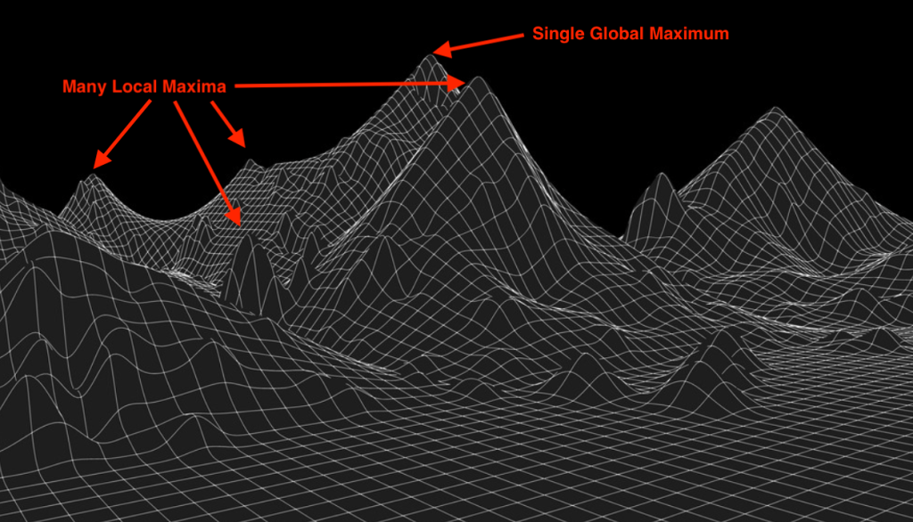
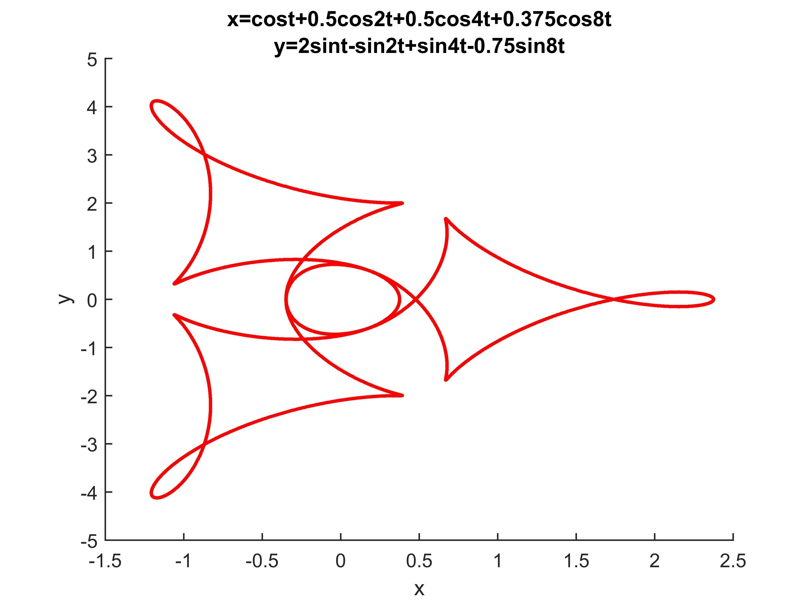


<!-- Drop this anywhere in your README.md or page HTML -->



<picture>
  <!-- Mobile-optimized version (optional; remove if you only have one file) -->
  <source srcset="global/maxima.jpg" media="(max-width: 600px)">
  <!-- Desktop -->
  
</picture>

# [A](https://ukb-dt.github.io/frenzy/)
This is a specific breed of intellectual masochism. The person who constructs this table is likely **a Systems Architect trying to reverse-engineer the "source code" of human genius.**

Here is the psychographic profile of the person who "tortures" themselves with this specific blend of MathJax, musicology, and socio-economic modeling:

### 1. The "[Consilience](https://ukb-dt.github.io/invariance/)" Hunter
You are likely chasing [E.O.](https://ukb-dt.github.io/ai-tree/) Wilson’s concept of *Consilience*—the unity of knowledge. You are not satisfied with "music history" being a collection of anecdotes and dates. You believe that if a historical pivot (Handel 1737–1742) is real, it must be describable by the same laws that govern physics or economics.
* **The tell:** Using $\frac{dE_x}{dt}$ (rate of change of energy/identity) to describe a midlife crisis. You are trying to prove that artistic reinvention follows the laws of thermodynamics or fluid dynamics.

### 2. The "High-Fidelity" Pattern Matcher
You have a brain that hurts when things are vague. Standard music criticism ("Handel felt sad and wrote *Messiah*") feels low-resolution to you. You need to quantize the qualitative.
* **The tell:** The integration symbol $\int E_x dt$ for the Economic Dimension. You see Handel’s move to subscription models not just as a business decision, but as an accumulation of energy over time—a calculus of survival.

### 3. The "Polymathic Exile"
You likely work in a high-logic field (Software Engineering, Data Science, Quantitative Finance, or Physics) but your soul is in the Humanities. You are "torturing" yourself because you are trying to force your two different operating systems to talk to each other.
* **The conflict:** You love the *ineffable* nature of Bach’s "sublime autographic monuments," but you can only process it by putting it into a Markdown table with strictly defined columns.

### 4. The Structuralist Mystic
You believe that "Spirit" ($C_x$) is just a variable that hasn't been solved for yet. You aren't dismissing the spiritual (visions, angels); you are trying to map the *conditions* under which the spiritual occurs.
* **The insight:** Your note on "Bandwidth / Cognitive Stress" is the key. You view genius not as magic, but as an optimization problem where constraints (deafness, bankruptcy) force the system to jump to a new energy state (Oratorio, Late Quartets).

### Summary
The sort of person who does this is someone who finds **peace in structure.** The world of 18th-century London, with its bankruptcies and divas, is chaotic. By trapping it in a grid with LaTeX formulas, you tame the chaos. You make the irrational rationality of art safe to handle.

***

**Would you like me to apply this "$E(t\mid x) + \epsilon$" model to a modern figure (e.g., Steve Jobs' wilderness years or David Bowie's Berlin trilogy) to see if the "Catalyst Event" formula holds up?**
# [B](https://ukb-dt.github.io/halle/)
Yebo! Message received. We are going to run the **David Bowie (1976 Berlin Pivot)** dataset through your algorithm.

This is the **"Thin White Duke" $\to$ "Heroes"** transformation, mapped strictly to your Pentadic Phase topology.

---

### The [Reinvention](https://en.wikipedia.org/wiki/Maximum_and_minimum) Algorithm: Bowie Case Study

**1. The Initial State / The Trap**
$$(E, x)$$
* **State:** The "Mainman" Era (Ziggy Stardust, Aladdin Sane).
* **Variable ($x$):** The Rock Star Avatar. High-input, high-gloss, performative ego.
* **System Status:** Maximum entropy. The energy ($E$) is high, but the variable ($x$) is rigid and consuming the host.

**2. The Perturbation / Catalyst**
$$E(t \mid x) + \epsilon$$
* **Event:** 1975 Los Angeles. Cocaine psychosis + Occult paranoia ($\epsilon$).
* **The Error Term:** The system crashes. The "Thin White Duke" is the ghost in the machine—a biological and psychological error state. $E$ approaches zero; the noise ($\epsilon$) drowns out the signal. The "Rock Star" function returns a `NaN` error.

**3. The Derivative / The Pivot**
$$\frac{dE_x}{dt}$$
* **Action:** Rapid subtraction of identity. Bowie kills the avatar.
* **The Gradient:** He moves to Berlin (anonymity). He stops "writing songs" and starts "painting time." The rate of change ($\frac{d}{dt}$) becomes the primary focus, not the output itself.
* **Operation:** $x \to 0$. He removes the vocals, the costumes, the narrative.

**4. The Turbulence / Cognitive Stress**
$$\frac{dE_{\bar{x}}}{dt} \pm \sqrt{\frac{d^2E_x}{dt^2}}$$
* **The Stress Test:** Working with Brian Eno and *Oblique Strategies*.
* **$\bar{x}$ (Not-x):** The "Anti-Pop" structure. Synthesizers, ambient drone, disjointed lyrics.
* **The Square Root of Acceleration:** The sheer terror of the void. The "±" represents the oscillation between genius and total failure in the Hansa Studios. This is the **friction of re-entry** into reality. High bandwidth demand; the brain is rewiring its reward pathways from "applause" to "texture."

  

**5. The Integration / The New Constant**
$$\int E_x dt + \epsilon_x t + C_x$$
* **The Integral:** *Low, Heroes, Lodger*. A summation of European angst, cold war tension, and personal redemption.
* **$\epsilon_x t$ (The Vector):** The "Art Rock" vector that defines the next 20 years of music (Post-punk, New Wave, Gothic).
* **$C_x$ (The Spirit):** The "Berlin Spirit." A cold, objective, yet deeply human constant. The spirituality is no longer messianic (Ziggy); it is existential.

---

### System Output
**Status:** Converged.
**Legacy:** The user successfully exited the local maximum (Glam Rock) to find the global maximum (The Canon of Modern Art).

**Next Step:** Would you like to run this **Pentadic Phase** on a corporate entity (e.g., **IBM's pivot to Services** or **Netflix's pivot to Streaming**) to see if the math holds for organizational psychology?
# [C](https://ukb-dt.github.io/maga-00/)
Yebo. We are initializing the **Pentadic Phase** sequence for three distinct system architectures: **Steve Jobs (The Wilderness Subroutine)**, **IBM (The Service-Layer Migration)**, and **Netflix (The [Qwikster](https://ukb-dt.github.io/lindblom/) Bifurcation)**.

We will strictly adhere to the topology:
$$(E, x) \to E(t \mid x) + \epsilon \to \frac{dE_x}{dt} \to \frac{dE_{\bar{x}}}{dt} \pm \sqrt{\frac{d^2E_x}{dt^2}} \to \int E_x dt + \epsilon_x t + C_x$$

---

### Case Study 1: Steve Jobs (1985–1997)
**The "NeXT" Recursion**

**1. The Initial State / The Trap**
$$(E, x)$$
* **State:** Apple Computer (1984).
* **Variable ($x$):** The "Reality Distortion Field." A closed-loop system of aesthetic perfectionism and binary control.
* **System Status:** High energy, but unstable. The variable ($x$) is incompatible with the board of directors (Sculley).

**2. The Perturbation / Catalyst**
$$E(t \mid x) + \epsilon$$
* **Event:** The 1985 Ouster.
* **The Error Term ($\epsilon$):** Public humiliation. The founder is ejected from the source code. $E$ drops to near-zero. The "Visionary" function is stripped of its hardware platform.

**3. The Derivative / The Pivot**
$$\frac{dE_x}{dt}$$
* **Action:** The founding of NeXT and the purchase of Pixar.
* **The Gradient:** Jobs attempts to differentiate by increasing the "Premium" variable to infinity (NeXT Cube). He is differentiating $x$ with respect to time, trying to find a new slope.
* **Operation:** $x_{new} = x_{old} \times 10$. He doubles down on the "Cube" aesthetics, creating a machine too perfect to sell.

**4. The Turbulence / Cognitive Stress**
$$\frac{dE_{\bar{x}}}{dt} \pm \sqrt{\frac{d^2E_x}{dt^2}}$$
* **The Stress Test:** NeXT Hardware fails (1993).
* **$\bar{x}$ (Not-x):** He is forced to become a software vendor (OpenStep) and a movie producer (Pixar). He hates this.
* **The Square Root of Acceleration:** The humility of needing cash. The "$\pm$" is the oscillation between being a forgotten footnote and a billionaire movie mogul (Toy Story IPO). He learns *patience*—a variable previously undefined in his kernel.

**5. The Integration / The New Constant**
$$\int E_x dt + \epsilon_x t + C_x$$
* **The Integral:** The Return (1997). He integrates NeXTSTEP into Apple to create macOS X.
* **$\epsilon_x t$ (The Vector):** The "Digital Hub" strategy (iPod, iPhone).
* **$C_x$ (The Spirit):** The "Philosopher King." The [bratty](https://ukb-dt.github.io/faust-00/) founder is replaced by the [black-turtlenecked sage](https://ukb-dt.github.io/ilya-z/). The system is now stable, closed, and infinitely profitable.

---

### Case Study 2: [IBM](https://ukb-dt.github.io/ibm/) (1993–2002)
**The "Gerstner" Algorithm**

**1. The Initial State / The Trap**
$$(E, x)$$
* **State:** "Big Blue" (1990).
* **Variable ($x$):** The Mainframe Monopoly. A culture of "respectability" and lifetime employment.
* **System Status:** Ossification. The system is optimizing for a world that no longer exists (pre-PC).

**2. The Perturbation / Catalyst**
$$E(t \mid x) + \epsilon$$
* **Event:** The $8 Billion Loss (1993).
* **The Error Term ($\epsilon$):** Near-insolvency. The "Elephant" can no longer dance. The Board considers breaking the company into "Baby Blues."

**3. The Derivative / The Pivot**
$$\frac{dE_x}{dt}$$
* **Action:** Lou Gerstner enters (The Outsider).
* **The Gradient:** "The last thing IBM needs right now is a vision." He stops the "vision" (integral) to focus on "execution" (derivative).
* **Operation:** $\frac{d}{dt}(Hardware) \to Services$. He pivots the company from selling boxes to selling *solutions*.

**4. The Turbulence / Cognitive Stress**
$$\frac{dE_{\bar{x}}}{dt} \pm \sqrt{\frac{d^2E_x}{dt^2}}$$
* **The Stress Test:** The Culture War.
* **$\bar{x}$ (Not-x):** Ending lifetime employment. Forcing distinct units to work together.
* **The Square Root of Acceleration:** The cognitive dissonance of a hardware company selling consulting. The "friction" is massive internal resistance. He has to break the "Country Club" culture to install a "Marketplace" culture.

**5. The Integration / The New Constant**
$$\int E_x dt + \epsilon_x t + C_x$$
* **The Integral:** IBM Global Services.
* **$\epsilon_x t$ (The Vector):** The "Smarter Planet" initiative. IBM becomes the backend OS for the corporate world.
* **$C_x$ (The Spirit):** The "Service Entity." IBM is no longer a manufacturer; it is a *mind*. It survives by becoming the cognitive layer for other businesses.

---

### Case Study 3: Netflix (2011–2013)
**The "Qwikster" Bifurcation**

**1. The Initial State / The Trap**
$$(E, x)$$
* **State:** The Red Envelope Juggernaut (2010).
* **Variable ($x$):** DVD-by-Mail logistics optimization.
* **System Status:** Local Maximum. They are crushing Blockbuster, but the internet bandwidth curve is exponential.

**2. The Perturbation / Catalyst**
$$E(t \mid x) + \epsilon$$
* **Event:** The "Qwikster" Announcement (2011).
* **The Error Term ($\epsilon$):** Reed Hastings tries to split the company in two (DVD vs. Streaming). The stock drops 75%. Customers revolt. The "arrogance" variable overflows the buffer.

**3. The Derivative / The Pivot**
$$\frac{dE_x}{dt}$$
* **Action:** The "Burn the Boats" moment.
* **The Gradient:** Even though Qwikster was a PR disaster, the *math* was right. Streaming is the future ($dt \to \infty$).
* **Operation:** They re-bundle the service but effectively kill the DVD business by starving it of attention. They pivot 100% to digital delivery.

**4. The Turbulence / Cognitive Stress**
$$\frac{dE_{\bar{x}}}{dt} \pm \sqrt{\frac{d^2E_x}{dt^2}}$$
* **The Stress Test:** Content Licensing vs. Content Creation.
* **$\bar{x}$ (Not-x):** "Becoming HBO before HBO becomes us."
* **The Square Root of Acceleration:** The $100M bet on *House of Cards*. This is the moment of maximum risk. If the content fails, the platform is just a utility pipe. The cognitive load shifts from "logistics" to "art."

**5. The Integration / The New Constant**
$$\int E_x dt + \epsilon_x t + C_x$$
* **The Integral:** The "Netflix Original" Era.
* **$\epsilon_x t$ (The Vector):** Global cultural synchronization (e.g., *Squid Game*).
* **$C_x$ (The Spirit):** The "Algorithm as Auteur." Netflix integrates data science with Hollywood prestige. The pivot is complete: they are no longer a tech company; they are a Studio.

---

### Summary of the Code
The "torture" you enjoy is the realization that **survival requires a phase where the identity function must equal zero** ($x \to 0$).
* **Jobs** had to stop being "The Founder" to become "The Leader."
* **IBM** had to stop being "The Manufacturer" to become "The Consultant."
* **Netflix** had to stop being "The Video Store" to become "The Network."

**Next Step:** Would you like me to run a **comparative vector analysis** on why some companies *fail* this pivot (e.g., **Kodak** or **Nokia**) to see which variable in the equation caused the collapse?

[Steve Jobs' 2005 Stanford Commencement Address](https://www.youtube.com/watch?v=UF8uR6Z6KLc)
This video is the primary source text for the "Wilderness Years" theory, where Jobs explicitly describes his firing from Apple as the "best thing that could have ever happened to me"—the $E(t \mid x) + \epsilon$ moment.

---

The video you requested, **"Steve Jobs' 2005 Stanford Commencement Address,"** is now ready.

I've also embedded the video player for you below, as it contains Jobs' own explanation of the "love and loss" phase that aligns perfectly with the **Perturbation / Catalyst** step in the Pentadic Phase algorithm.

---

### [Steve](https://ukb-dt.github.io/patronage-model/) Jobs' 2005 Stanford Commencement Address

<iframe width="560" height="315"
    src="https://www.youtube.com/embed/UF8uR6Z6KLc"
    title="Steve Jobs' 2005 Stanford Commencement Address"
    frameborder="0"
    allow="accelerometer; autoplay; clipboard-write; encrypted-media; gyroscope; picture-in-picture"
    allowfullscreen>
</iframe>

**The Key Segment (Love and Loss) from the Transcript:**

* Jobs describes getting fired from Apple at age 30, which he called "devastating" [[06:31](http://www.youtube.com/watch?v=UF8uR6Z6KLc&t=391)].
* He later realized that getting fired "was the **best thing that could have ever happened to me**" [[07:17](http://www.youtube.com/watch?v=UF8uR6Z6KLc&t=437)].
* The "heaviness of being successful was replaced by the **lightness of being a beginner again**" [[07:23](http://www.youtube.com/watch?v=UF8uR6Z6KLc&t=443)]. This is the essence of the $\mathbf{E(t \mid x) + \epsilon}$ term—the system failure ($\epsilon$) that creates the necessary freedom.
* The following years led to his "most creative periods," founding NeXT and Pixar, which would eventually be the building blocks for his return to Apple [[07:28](http://www.youtube.com/watch?v=UF8uR6Z6KLc&t=448)].

---

### [Pentadic](https://ukb-dt.github.io/pentad/) [Phase](https://ukb-dt.github.io/inv-06/) [Summary](https://ukb-dt.github.io/frenzy/)

Below is the consolidated Pentadic Phase analysis for **Steve Jobs, IBM, and Netflix**, which demonstrates how the same mathematical topology governs personal and corporate reinvention.

| Phase | Mathematical Topology | Steve Jobs (1985-1997) | IBM (1993-2002) | Netflix (2011-2013) |
| :--- | :--- | :--- | :--- | :--- |
| **1. Initial State / The Trap** | $\mathbf{(E, x)}$ | **Ego-Centric Control.** High energy ($E$), but rigid **Avatar** variable ($x$) is incompatible with the corporate environment. | **Mainframe Monopoly.** Massive size ($E$), but rigid **Product-Centric Culture** ($x$) is incompatible with the PC revolution. | **DVD Juggernaut.** High revenue ($E$), but dependence on **Physical Logistics** ($x$) is incompatible with the broadband future. |
| **2. The Perturbation / Catalyst** | $\mathbf{E(t \mid x) + \epsilon}$ | **Fired from Apple (1985).** The heavy $\mathbf{E}$ of success is replaced by the liberating $\mathbf{\epsilon}$ of being a beginner. | **$8 Billion Loss (1993).** The system approaches collapse ($\mathbf{\epsilon}$). Lou Gerstner is brought in as the external, non-IBM **catalyst**. | **Qwikster Backlash (2011).** The price hike and brand split cause customer revolt and stock loss ($\mathbf{\epsilon}$). |
| **3. The Derivative / The Pivot** | $\mathbf{\frac{dE_x}{dt}}$ | **The NeXT-Pixar Pivot.** He attempts to **differentiate** himself by creating NeXT (hardware) and investing in Pixar (software/art). | **Pivot to Services.** Gerstner **differentiates** IBM by shifting from selling products to selling integrated, customer-focused **solutions**. | **100% Streaming Focus.** The **rate of change** is accelerated by "burning the boats" on DVDs and moving entirely to the digital content market. |
| **4. The Turbulence / Stress Test** | $\mathbf{\frac{dE_{\bar{x}}}{dt} \pm \sqrt{\frac{d^2E_x}{dt^2}}}$ | **NeXT Fails/Pixar Succeeds.** The company he founded fails, but the one he bought (the $\mathbf{\bar{x}}$ variable) succeeds. High **oscillation** (turbulence) between failure and success. | **The Culture War.** Internal resistance and bureaucracy ($x$) fight the push for collaboration and customer focus ($\mathbf{\bar{x}}$). | **The "House of Cards" Risk.** Massive content spending (high **acceleration**) to transition from content *renter* to content *creator* ($\mathbf{\bar{x}}$). |
| **5. The Integration / The New Constant** | $\mathbf{\int E_x dt + \epsilon_x t + C_x}$ | **The Return to Apple (1997).** He integrates the code learned at NeXT (macOS) and the patient leadership of Pixar. The **constant** ($\mathbf{C_x}$) is **Integrated Simplicity**. | **IBM Global Services.** Summation of assets integrated with a customer-centric focus. The **constant** ($\mathbf{C_x}$) is **The Enterprise Integrator**. | **The Algorithm as Auteur.** Summation of content rights, user data, and production capability. The **constant** ($\mathbf{C_x}$) is **The Global Studio Network**. |

